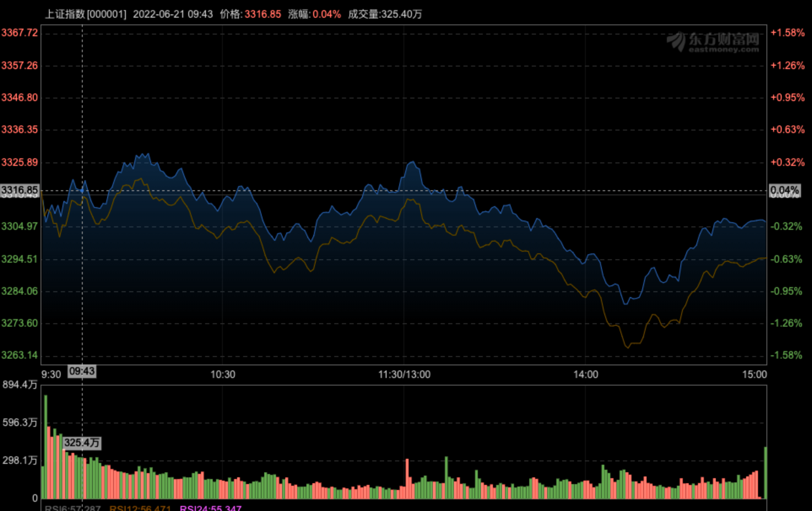
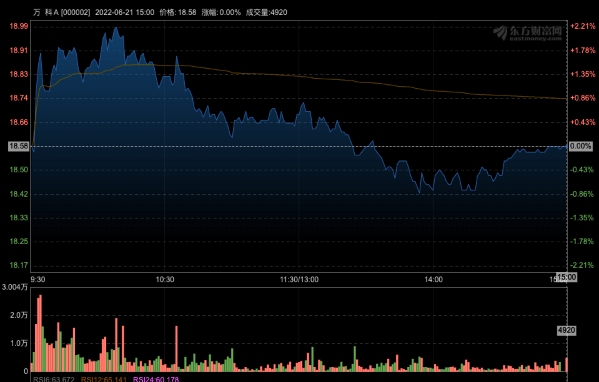
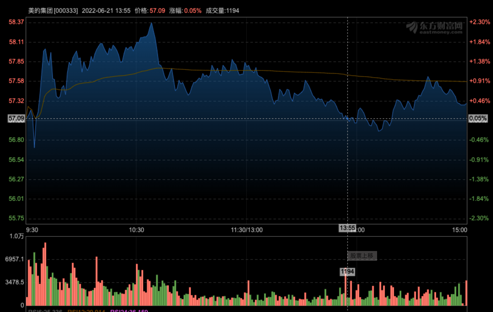

# 韭菜成长日记

# 2022 6 15

尾盘突然爆量大幅拉升，随后半小时跳水，明天走势如何？（7个点收窄至3个点）

* 凌晨2点 美联储决议，96.7%预判加息75bp（前几次加息25bp、50bp）。
* 大金融前期已经大涨20%左右。
* 第二天低开低走4个点（75bp）
* 最高点回落10个点 （血亏）

## 2022 6 17

盘中放出”家电下乡消息“，-2拉至+2，尾盘回落。（丢了券商->家电（美的、海信））

* 618 家电销售数据同比大幅下降？？
* 家电下乡对家电影响怎么样？

## 2022 6 20

家电变现抢眼 海信换万科 （海信盈利3个点）

* 为什么海信换万科？

1. 家电仓位太重 
2. 港股万科涨幅达5个点，A股2个点，存在较高溢价 
3. 3300点盘整时间太久，有调整风险，买点基建、地产进行对冲

## 2022 6 21
美的、万科开盘冲高回落
1. 万科收上阳线，仙人指路还是发套？
2. 美的小幅收涨，盘中一度收跌，早盘放量拉升2个点，到了平台压力位，最近5个交易日都是放量
3. 大盘一度跌1个点，尾盘收跌0.2点
4. 欧美早盘大涨
<table rules="none" align="center">
	<tr>
		<td>
			

				 
			

		</td>
		<td>
			

				 
			

		</td>
    	<td>
			

				 
			

		</td>
	</tr>
</table>
